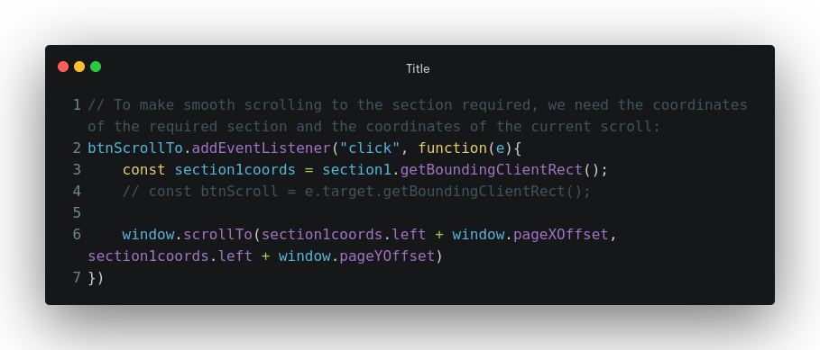

# js-snippets

## Table of contents:

1. [Description](#description)
2. [Code](#code)
3. [References](#references)

### Description

To make smooth scrolling to the required section, we need the coordinates of the required section and the coordinates of the current scroll. Then, we use `window.scrollTo()` method to make the scrolling work.

### Code

### References

1. [DOMRect describes the size and position of a rectangle](https://developer.mozilla.org/en-US/docs/Web/API/DOMRect)
2. [getBoundingClientRect provides info abt the size of an element and its position relative to viewport.](https://developer.mozilla.org/en-US/docs/Web/API/Element/getBoundingClientRect)
3. [pageYOffset returns the number of pxs that the document is currently scrolled vertically](https://developer.mozilla.org/en-US/docs/Web/API/Window/scrollY)
4. [pageXOffset returns number of pxs that the document is currently scrolled horizontally](https://developer.mozilla.org/en-US/docs/Web/API/Window/scrollX)
